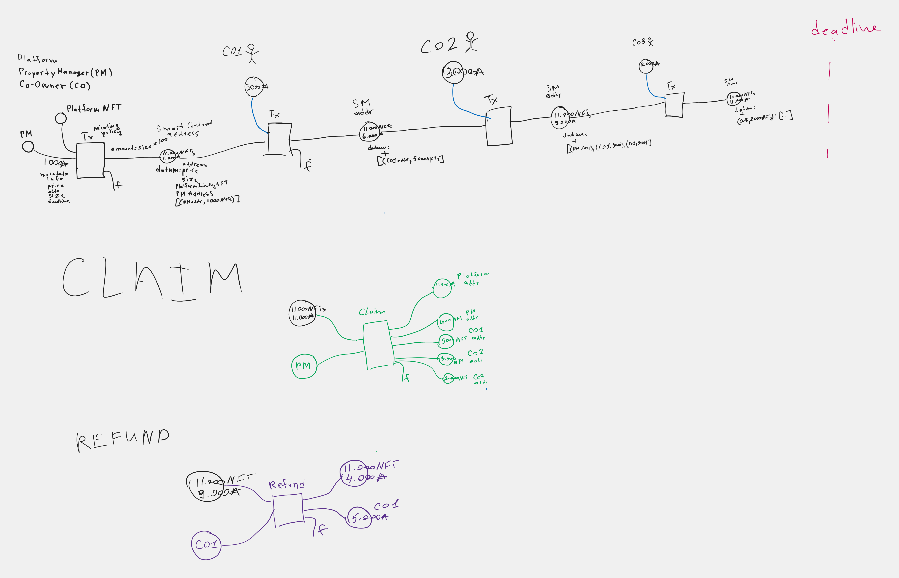

# Franctional Ownership NFT in real estate

# Franctional Ownership NFT in real estate

## The idea

Converting a real estate property into NFTs.

Two Roles

1. Platform
2. Property Manager (PM)
3. Co-Owner (CO)

Steps

1. PM: Select property and fill in the price, address, size of a house and a deadline.
2. In a first transaction: the Platform with PM mint NFTs in amount equal to size of the house multiplied by 1000
3. In multiple transactions: COs will send ADA to the address (UTXOs will be locked at the script address).
4. One of these roles can do the claim transaction:
   - PM can claim ADA if validation passed.
   - COs can claim the money back after the deadline passed plus 3 days.
   - Platform can only claim to return ADA to original address.
     3.1. Claim by PM validator logic:
   - Deadline is reached
   - Amount of locked ADA value > listed price
   - Singed by PM
   - Singed by Platform
     3.2. Claim by CO validator logic:
   - Deadline is reached + 3 days
   - Signed by CO
     3.3. Claim by Platform validator logic:
   - Deadline is reached + 2 weeks
   - Singed by Platform



## Development

Write validators in the `validators` folder, and supporting functions in the `lib` folder using `.ak` as a file extension.

For example, as `validators/always_true.ak`

```gleam
validator {
  fn spend(_datum: Data, _redeemer: Data, _context: Data) -> Bool {
    True
  }
}
```

### Building

```sh
aiken build
```

### Testing

You can write tests in any module using the `test` keyword. For example:

```gleam
test foo() {
  1 + 1 == 2
}
```

To run all tests, simply do:

```sh
aiken check
```

To run only tests matching the string `foo`, do:

```sh
aiken check -m foo
```

### Documentation

If you're writing a library, you might want to generate an HTML documentation for it.

Use:

```sh
aiken docs
```

### Resources

Find more on the [Aiken's user manual](https://aiken-lang.org).
